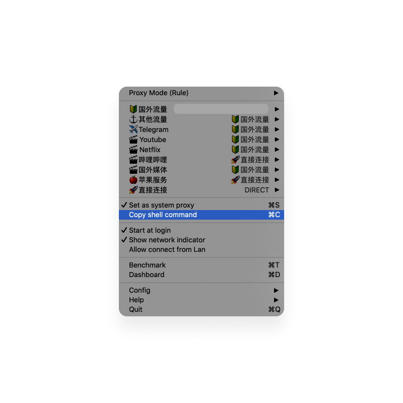

# 01-intro-to-react

开发环境搭建

## 1.安装 Homebrew

Homebrew 是 macOS 下的基于命令行的软件包管理器，可以简单的理解为非图形化但是异常强大的软件包下载工具。
Homebrew 本身的安装也是要通过命令行来完成的，在终端 Terminal 里输入以下命令即可，过程中需要输入密码，输入完回车可以完成安装：

`/bin/bash -c "$(curl -fsSL https://raw.githubusercontent.com/Homebrew/install/master/install.sh)"`

如果安装失败可能是某些文件由于网络问题，国内获取受限导致的，可以通过更换为下面的命令行重新下载，来源于[知乎](https://www.zhihu.com/question/35928898)

`/bin/zsh -c "$(curl -fsSL https://gitee.com/cunkai/HomebrewCN/raw/master/Homebrew.sh)"`

## 2.通过 Homebrew 安装 Node

Node 是一个基于 Chrome V8 引擎的 JavaScript 运行环境，一个让 JavaScript 运行在服务端的开发平台。学习 React 要安装 Node，用于 React 开发和模块管理的主流工具 Webpack 必须在 Node 的环境下执行。安装 Node 时会附赠一个包管理工具 Node Package Manager，即 npm。
命令行如下：

`brew install node`

如果安装不成功可以尝试[官网](https://nodejs.org/en/)下载安装。

## 3.通过 npm 安装 gatsby-cli

命令行如下：

`npm install -g gatsby-cli`

命令行里的 -g 是全局安装的意思，相应的有全局安装也有局部安装。cli 是 command line interface 的缩写，可以理解为命令行接口；与之对应的是 GUI，即 graphical user interface，图形用户接口，也有翻译为图形用户界面，后一翻译因为 UI 设计而被广为传播，这两者之间概念是否一致，值得玩味。

我用命令行下载安装了几次没有成功，经朋友提示是 TiZi 代理的问题，我用的是 clash 客户端，选择了 Proxy Mode 为 Rule 规则，然后 Copy shell command，黏贴到终端里运行一下，再执行上面的命令，就安装成功了。

还有一种情况安装失败是因为没有权限，可以尝试在命令行前面加 sudo，命令行示例如下：

`sudo npm install -g gatsby-cli`

## 4.通过 gatsby 创建项目

通过命令行打开想创建项目的文件路径，比如想把项目放在 Documents 下，命令行示例如下：

`cd Documents/`

然后通过 gatsby 创建项目，需要几分钟（视网络状况而定），命令行示例如下：

`gatsby new my-app`

my-app 是可以自己定义的项目名称。

## 5.通过 gatsby 运行项目

打开想要运行的项目的文件路径，命令行示例如下：

`cd my-app`

通过 gatsby 运行项目，命令行如下：

`gatsby develop`

运行成功之后，在浏览器输入 localhost:8000 就能看到 gatsby 框架生成的默认网页了，如果此时把终端关闭，那网页就会打开失败，因为运行环境是由终端在执行的。

## 6.补充

- mengto 介绍了把项目上传到 Github 来同步代码，如果是只有一个本地环境来和 GitHub 同步，问题不大，但多个本地环境和同一个 GitHub 项目同步，我实践的过程中遇到了一些问题

- Node、Webpack、npm 这三者究竟是什么，三者的关系，我目前只能说模模糊糊的理解，但还没能力讲清楚。

- 我在跟着 mengto 的教程学 React 的过程中，感受到除了这门语言本身的学习，还需要对 GitHub、VS Code、Terminal 比较熟悉，当然这也是开发人员必备的的。

## 7.推荐文章

- [程序员 Homebrew 使用指北](https://sspai.com/post/56009#toc_22)
- [Gatsby.js 中文教程](https://www.gatsbyjs.cn/tutorial/)
  写的是真好，收获良多。
