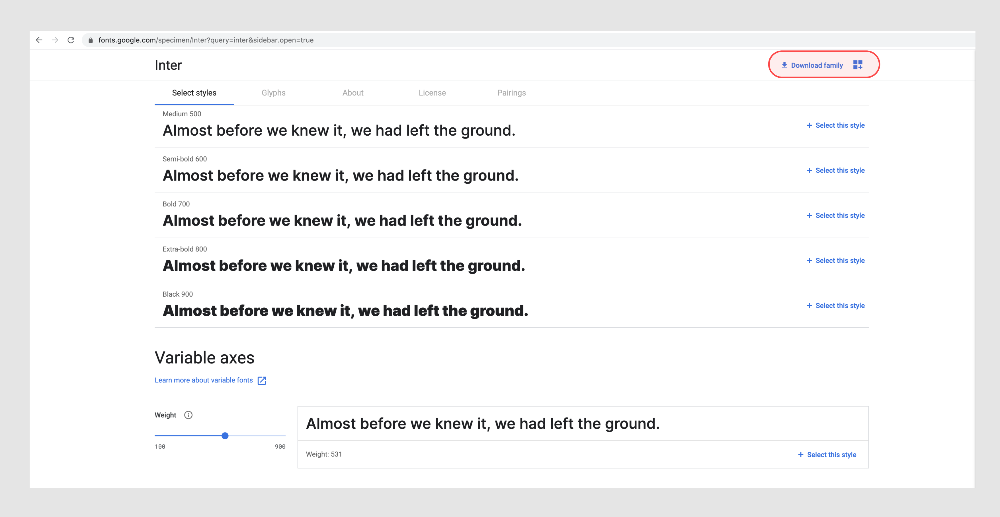

# 02-BasicStylinginCSS

编写基础 CSS 样式代码

## 1.使用 [Google Fonts](https://fonts.google.com/) 静态字体

Google Fonts 是 Google 的一个免费开源字体库，设计师人手必备。

引入到网页有两种方式：<link>标签和 CSS @import，我选择的是 @import 引入的方式，以 Inter 这个字体为例，注意此处我引用的是 Inter 的 Regular 400 这个字重的字体，CSS 源码示例如下：

```
<style>

@import url('https://fonts.googleapis.com/css2?family=Inter&display=swap');

body {
  font-family: 'Inter', sans-serif;
  font-weight: 400;
}

</style>
```

## 2.使用 [Google Fonts](https://fonts.google.com/) 可变字体

如果对 variable fonts 可变字体不了解，可以看一下这篇文章 [Introduction to variable fonts on the web](https://web.dev/variable-fonts/)

Google Fonts 里目前支持不少 variable fonts，这里还是以 Inter 为例，上面的例子只引入了 Regular 400 这一种静态字体，只有 `font-weight:400` 这一个字重，而引入 variable fonts 则可使用字体支持范围内的任意字重，用 @font-face 引入，示例代码如下：

```
<style>

@font-face {
  font-family: "Inter", sans-serif;
  src: url("../fonts/Inter.var.woff2") format("woff2");
  font-weight: 1 999;
  font-display: swap;
}

body {
  font-family: "Inter", sans-serif;
  font-weight: 777;
}

</style>

```

**Tips:** 相对路径 `src: url("../fonts/Inter.var.woff2")` 里的可变字体文件可以在 Google Fonts 里的 Download Family 下载到：



## 3.CSS 中 background-size 设置背景图片大小

在保持原有比例的前提下，通常采用下面两种

```
background-size:contain;
background-repeat:no-repeat;
```

```
background-size:cover;
```

二者的区别对应到设计图上应该是这样：


## 问题与解决问题

#### 1.今天频繁的遇到 package.json 文件报警，但不知道什么原因

**解决：** 打开 VS Code 的 setting.json 文件，添加以下代码，保存即可解决

` "http.proxyAuthorization": "false"`

#### 2.GitHub 上的同一个 gatsby 项目在不同电脑上 coding 遇到的缺少依赖无法运行项目的问题

**解决：** 在缺少依赖的项目终端下运行以下代码补充依赖，即可解决

`npm install`
