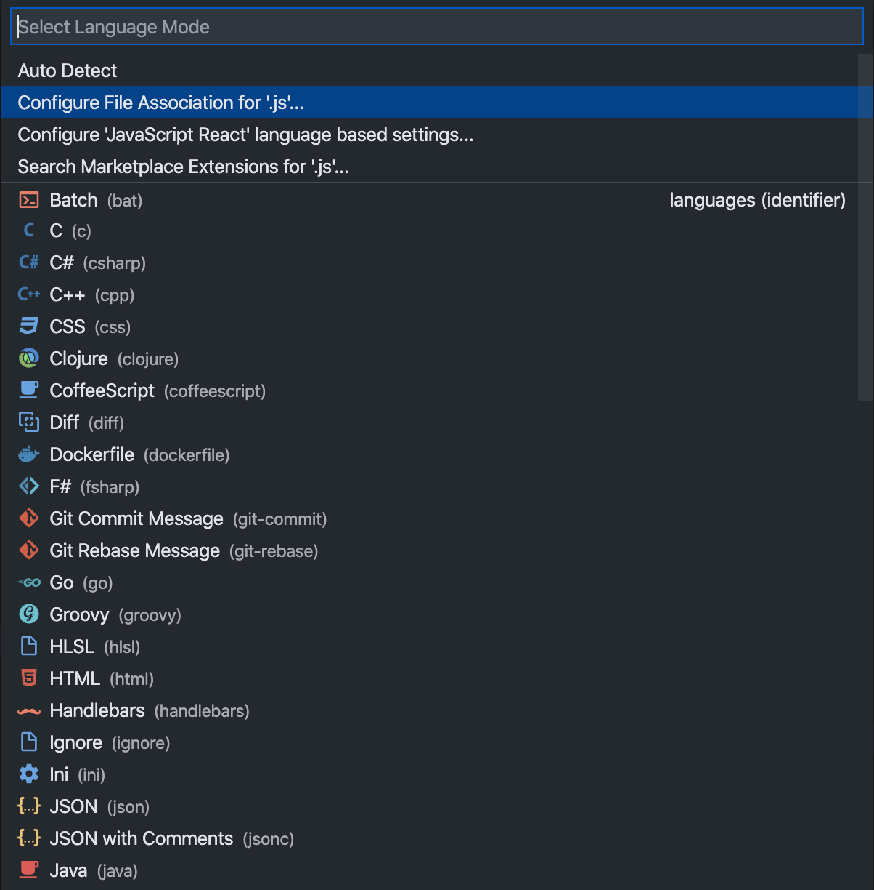
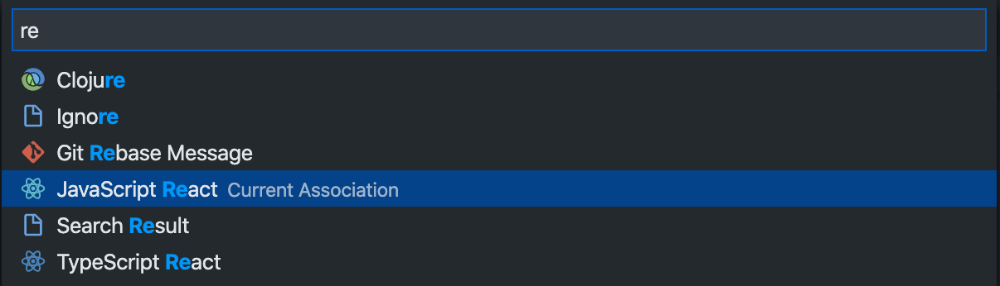
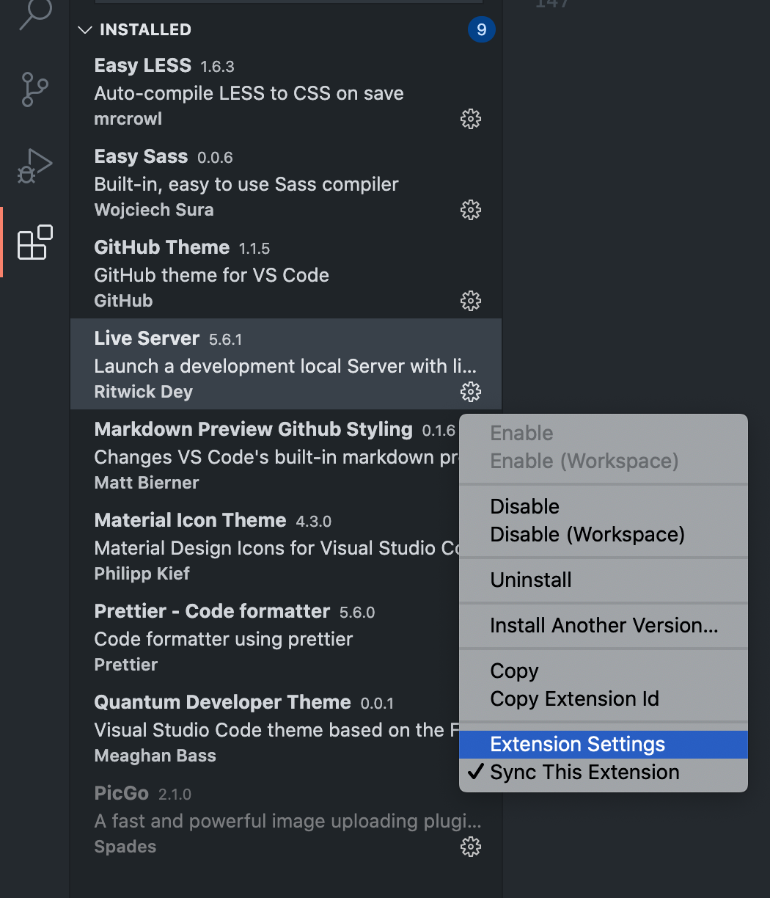
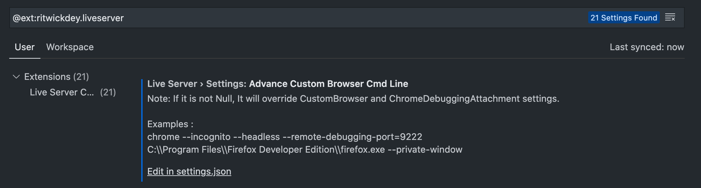
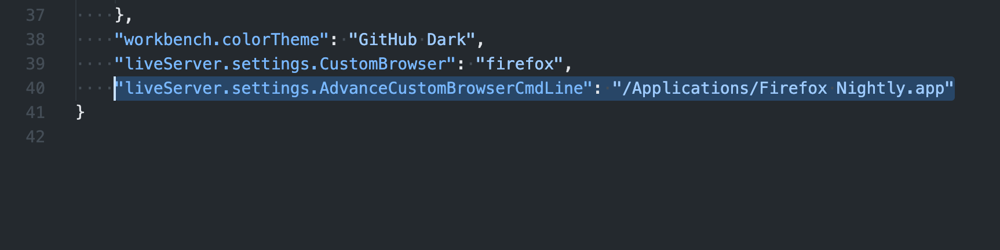

# AdaptiveLayoutswithCSSGrid

编写基础 CSS 样式代码

## 1.使用 [Google Fonts](https://fonts.google.com/) 字体

Google Fonts 是 Google 的一个免费开源字体库，设计师人手必备。

引入到网页有两种方式：<link>标签和 CSS @import，我选择的是第二种 CSS 引入的方式，以 Racing Sans One 这个字体为例，CSS 源码示例如下：

```
@import url("https://fonts.googleapis.com/css2?family=Racing+Sans+One&display=swap");

* {
  font-family: "Racing Sans One", cursive;
}
```

## 问题与解决问题

#### 1.更改 VS Code 项目语言设置

React 的 JSX 是 JavaScript 的语法扩展，在 VS Code 中并没有默认开启，需要手动开启，点击底部状态栏的 **SelectLanguageMode** 可以为当前文件选择对应的语言，也可以通过更改 **ConfigFileAssociationFor** 来把 JS 关联为 react，这样统一关联后，比较方便，要不然每个文件打开都去底部点一下，会累死。





### 2.更改 VS Code 插件 Live Sever 的默认浏览器

经过一段时间的编程学习，发现 Firefox 系列的浏览器在检查代码的时候，体验比 Chrome 好太多太多了，因此决定把常用的插件 Live Sever 的默认打开浏览器改为目前在用的 Firefox Nightly。

找到插件，右键选择 Extension Settings：



然后选择 Advance Custom Browser Cmd Line 下面的 Edit in settings.json:



在底部添加新命令即可，下面的示例是添加了我的 Firefox Nightly.app

```
"liveServer.settings.AdvanceCustomBrowserCmdLine": "/Applications/Firefox Nightly.app"
```



( **Tips:** 软件的路径可以通过一个小技巧得到，打开终端 Terminal，把想要查看的软件，文件或者文件夹拖拽到终端里面就会显示出来具体的路径，终端里显示的路径是包含转义符的，而 VS Code 的 setting json 里不需要包含转义符，所以如果有转义符的话，记得去掉，比如我上面的例子中，在 终端里显示的路径其实是 /Applications/Firefox\ Nightly.app，要把 Firefox 后面的反斜杠去掉后写进 VS Code 里才正确。)
