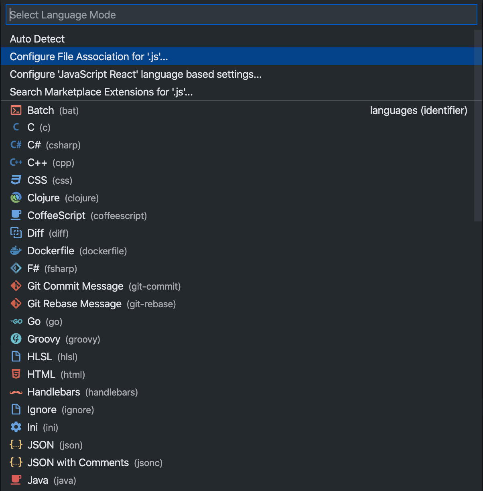
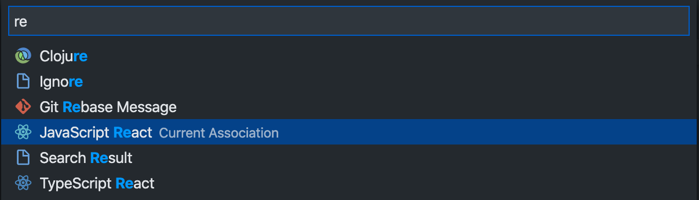

# AdaptiveLayoutswithCSSGrid

编写基础 CSS 样式代码

## 1.使用 [Google Fonts](https://fonts.google.com/) 字体

Google Fonts 是 Google 的一个免费开源字体库，设计师人手必备。

引入到网页有两种方式：<link>标签和 CSS @import，我选择的是第二种 CSS 引入的方式，以 PT Mono 这个字体为例，CSS 源码示例如下：

## 问题与解决问题

#### 1.更改 VS Code 项目语言设置

React 的 JSX 是 JavaScript 的语法扩展，在 VS Code 中并没有默认开启，需要手动开启，点击底部状态栏的 **SelectLanguageMode** 可以为当前文件选择对应的语言，也可以通过更改 **ConfigFileAssociationFor** 来把 JS 关联为 react。

