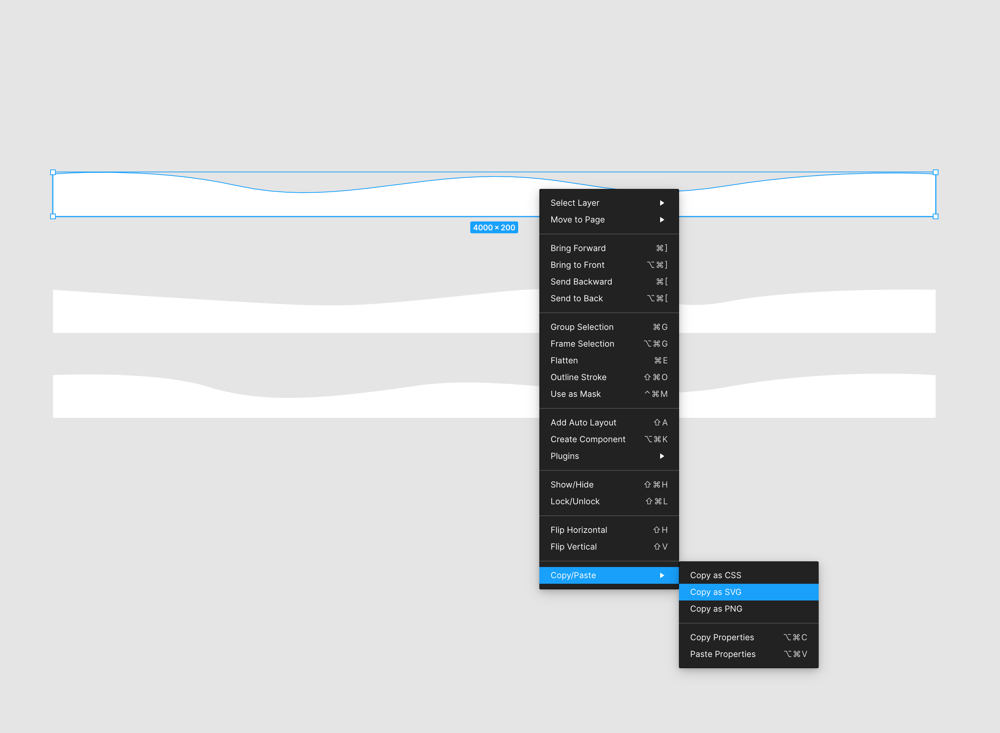

# 05-SVGAnimation

SVG 动画

## 关键点

从 Figma 复制的静态 SVG 代码：



```
    <svg
        width="4000"
        height="200"
        viewBox="0 0 4000 200"
        fill="none"
        xmlns="http://www.w3.org/2000/svg"
      >
        <path
          d="M0 7.7631C0 7.7631 427.5 -29.8831 835 60.6283C1242.5 151.14 1587.5 18.9765 2005 18.9765C2422.5 18.9765 2555 141.528 3057.5 60.6283C3560 -20.2714 4000 7.7631 4000 7.7631V200H0V7.7631Z"
          fill="white"
        />
    </svg>

```

制作 SVG 动画需要添加用 `<path></path>` 标签包裹的 `<animate></animate>` 标签，所以需要把代码里的闭合标签 `<path />` 改成结束标签 `<path></path>`，给 `<animate>` 添加 5 个属性，其中`values=" "` 的值为 SVG 里 path 的 `d=" "` 值，所以把 `d` 的值复制过去即可，然后删掉 path 里的 `d` 属性。

修改完的代码如下：

```
    <svg
        width="100%"
        height="200"
        fill="none"
        xmlns="http://www.w3.org/2000/svg"
      >
        <path fill="white">
          <animate
            repeatCount="indefinite"
            fill="freeze"
            attributeName="d"
            dur="5s"

            values="M0 7.7631C0 7.7631 427.5 -29.8831 835 60.6283C1242.5 151.14 1587.5 18.9765 2005 18.9765C2422.5 18.9765 2555 141.528 3057.5 60.6283C3560 -20.2714 4000 7.7631 4000 7.7631V200H0V7.7631Z"
          />
        </path>
    </svg>

```

里面的 `values` 值代表的这个 SVG 是不同状态下的一种，需要更改 SVG 的形态添加不同的状态值，来完成 SVG 动画，下面的示例是在原有的基础上又添加了 3 段值，最后一个值和添加前的值相同，表示循环闭合。注意最后一段值后面不要加分号

```
    <svg
        width="100%"
        height="200"
        fill="none"
        xmlns="http://www.w3.org/2000/svg"
      >
        <path fill="white">
          <animate
            repeatCount="indefinite"
            fill="freeze"
            attributeName="d"
            dur="5s"

            values="M0 7.7631C0 7.7631 427.5 -29.8831 835 60.6283C1242.5 151.14 1587.5 18.9765 2005 18.9765C2422.5 18.9765 2555 141.528 3057.5 60.6283C3560 -20.2714 4000 7.7631 4000 7.7631V200H0V7.7631Z;

            M0 4.58094C0 4.58094 340 29.0709 835 58.4592C1330 87.8476 1370 82.9483 2005 16.0093C2640 -50.9298 2715 124.582 3057.5 58.4592C3400 -7.66354 4000 4.58094 4000 4.58094V200.502H0V4.58094Z;

            M0 6.98955C0 6.98955 460 -16.3329 705 60.0675C950 136.468 1217.5 117.166 1645 55.2422C2072.5 -6.68186 2570 148.531 3057.5 60.0675C3545 -28.3957 4000 6.98955 4000 6.98955V200H0V6.98955Z;

            M0 7.7631C0 7.7631 427.5 -29.8831 835 60.6283C1242.5 151.14 1587.5 18.9765 2005 18.9765C2422.5 18.9765 2555 141.528 3057.5 60.6283C3560 -20.2714 4000 7.7631 4000 7.7631V200H0V7.7631Z"
          />
        </path>
    </svg>

```
